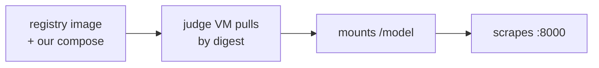
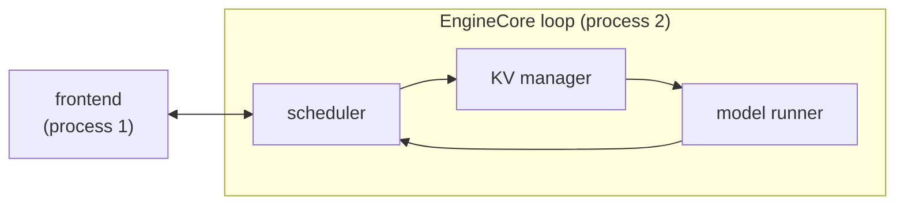
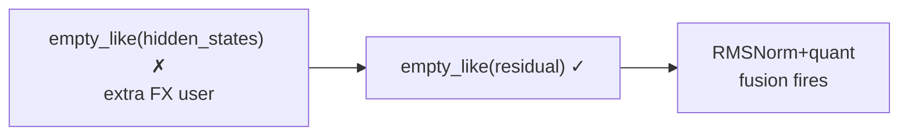
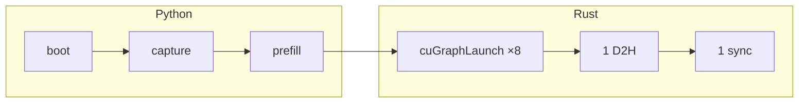
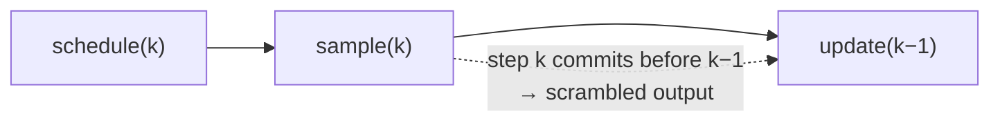

# From `docker compose up` to a Rust CUDA-graph runner

**30 min · Viettel "AI Race" LLM inference, task 3 · 21 slides.** One block = one slide:
`visual:` names a class from [slide-design](slide-design.md) §3, `say:` is the line, and every
`number:` traces to a repo source. Flow-shaped visuals carry a mermaid sketch of the
final diagram. Detail: [speaker notes](tech-talk-speaker-notes.md).

Open 01-03 (1.5) · Game 04-06 (3) · vLLM 07 (2.5) · Rung 1 flags 08-09 (3.5) · Rung 2 host 10-13 (4.5) · Rung 3 kernels 14-15 (2.5) · Rung 4 runner 16-18 (4.5) · Scored 19-20 (3) · Close 21 (2) — 27 min, leaving ~3 min Q&A.

legacy refs for the [primer](vllm-architecture-primer.md): §2→07 · §3→08-09 · §4a→11-13 · §4b→14-15 · §4c→16-18 · §5→19-20 · §6→21

---
## 01 · From `docker compose up` to a Rust CUDA-graph runner
visual: title slide — mono pill tag, radial halo, stat pills below
say: Eight weeks, 388 commits, three rounds — and three completely unrelated problems.
number: 8 weeks · 388 commits · 3 rounds
## 02 · The false start
visual: .big-quote — `60c44cd  remove custom rust inference`
say: The first two weeks built our own Rust inference engine. We deleted it in one commit.
number: ~2 weeks of work · 1 commit to delete
## 03 · The question that runs this talk
visual: .hbar — 1 ms GPU floor | 2 ms unaccounted
say: Decode on the judge's slice cost 3 ms a token. The GPU only needed 1. Where are the other two?
number: 3 ms observed · ~1 ms GPU floor
## 04 · The contract
visual: .flow — registry image + our compose → judge mounts /model → scrapes :8000
say: Locked entrypoint, no build context, finite attempts, and a dead endpoint scores zero — so the VM never builds, it pulls.
number: images built in CI, pulled by digest · a gutted build fails silently


## 05 · The scoreboard
visual: .qrow — TPOT band 1-10 ms (round 1.2) vs 8-100 ms (round 2)
say: Score is the fraction of requests landing inside the latency band, with γ=2 so tails are punished quadratically.
number: γ=2 · band widened 10× between rounds · 1 ms TPOT ≈ 28-37 ms TTFT
## 06 · Three rounds, three bottlenecks
visual: .fact-row ×3 — 1.1 prefill-bound · 1.2 host-bound · 2 completion-bound
say: A 101-to-1 prefill trace, then a 1-10 ms TPOT band, then a 122B MoE replaying real Claude Code sessions.
number: both 1.x rounds on one 18 GB slice — 16 SMs, 3 vCPU, 8 GB RAM
## 07 · vLLM in one slide
visual: .arch — frontend │ EngineCore loop: scheduler → KV manager → model runner
say: Prefill sets TTFT, decode sets TPOT, and every per-step cost the runner pays in Python lands straight on TPOT.
number: 2 processes · 1 step = 1 forward pass over the whole in-flight batch


## 08 · Rung 1: the flags that mattered
visual: .fact-row — prefix caching · max-model-len 32768 · max-num-seqs 256→16
say: Prefix caching was the single biggest win and it is lossless; size the context to the trace, not to the model card.
number: 82.4% block hit · 1.99M of 2.41M prefill tokens eliminated · frontier ~62.5
## 09 · Rung 1: the ledger and its nulls
visual: .fact-row — 3 boots/arm · ~0.5 ms noise floor · rejected: KV offload, spec-decode
say: The compose file is the engineering log — every flag carries its measurement, and the nulls stay in.
number: `use_inductor_graph_partition` measured worse · 17% of scored tokens decoded outside the captured graphs
## 10 · Rung 2: the host IS the TPOT
visual: .hbar — 1 ms GPU | 2 ms host
say: Async scheduling makes TPOT the max of host and GPU — so two of every three milliseconds were Python, not silicon.
number: 1 ms of TPOT ≈ 8.6 score points at our operating point
## 11 · Rung 2: not a fork
visual: .stack — stock site-packages ← `patch -p1` overlay ← ~30 `VTL_ENABLE_*` modules
say: Anything that could be a runtime monkey-patch is one; patches exist only where there is no Python seam to wrap.
number: `VTL_DISABLE=1` = provably stock · a base-image bump fails the build loudly

```mermaid
flowchart BT
    S["stock site-packages"] --> P["`patch -p1` overlay<br/>(no Python seam)"] --> V["~30 VTL_ENABLE_* modules<br/>(runtime monkey-patches)"]
```
## 12 · Rung 2: the one-line win
visual: .flow — `empty_like(hidden_states)` ✗ → `empty_like(residual)` ✓ → fusion fires
say: The wrong allocation source gave the FX node a user outside the fusion pattern, so RMSNorm+quant silently never fired.
number: 10 of 16 layers left unfused · one line to unblock a whole fusion pass


## 13 · Rung 2: the Rust frontend
visual: .flow — sonic-rs parse → iceoryx2 shared memory → per-token SSE
say: Per-token SSE is mandatory — emit N tokens per record and a chunk-counting grader reports TPOT N times worse than reality.
number: judge-swept worker threads at 1/2/3 → 71.5 / 72.5 / 72.1


## 14 · Rung 3: the kernel rules
visual: .fact-row — bit-match stock · `*_supported()` refuses · parity vs the op chain
say: More accurate is a different kernel, not a better one — we match stock element-for-element, double-rounding included.
number: 8 kernels · refuse the unsupported layout, never approximate it
## 15 · Rung 3: the one we didn't build, the one we reverted
visual: .ladder — projected 0.14 ms ≈ 0.0012 ERS, gated and never built / GDN epilogue reverted
say: Kernel speed was modelled, not measured — so one build stayed behind measured go/no-go gates, and another was reverted.
number: round 2's GDN epilogue: 0.25 ms of host to save 0.8 µs of HBM — a 300× loss
## 16 · Rung 4: the align gate
visual: .kvblock — a 4-token burst inside one 16-token block
say: The host tax is per engine step, not per token — so emit N tokens a step, but only while the burst stays in one KV block.
number: `num_computed % block_size + N ≤ block_size` covers 13 of 16 decode steps
## 17 · Rung 4: the launch loop leaves Python
visual: .flow — Python: boot · capture · prefill │ Rust: cuGraphLaunch ×8 → 1 D2H → 1 sync
say: torch 2.11 hands out the graph exec as a plain int and vLLM never re-instantiates a decode graph, so Rust can replay it.
number: 8 back-to-back launches · one D2H · one event · one sync


## 18 · Rung 4: hazard 8
visual: .timeline — schedule(k) → sample(k) → update(k-1), commit landing out of order
say: A depth-2 async queue let step k's tokens append ahead of step k−1's: scrambled output, and nothing to crash.
number: fix = commit inside `update_from_output` · shadow-verify with TWO launches


## 19 · What actually scored
visual: .score-bars — 81.62 | 89.26 (gold) | 89.86 | 83.61
say: Two flags on the untouched image bought 7.6 points. Everything we built after that bought under 0.6.
number: +7.6 from flags · +0.6 from the custom stack
## 20 · What we cannot prove
visual: .big-quote — "a runner that quietly never armed looks exactly like one that ran and did not help"
say: Round 1.2 removed its engagement counters and round 2 shipped REQUIRE=0, so neither centerpiece can be shown to have run.
number: no judge-box logs · one 900 s run on a hidden seed cannot resolve 0.6 points
## 21 · Four lessons
visual: .fact-row ×4, gold on the last
say: Map the architecture first · measure on the real box · earn the right to rewrite · make engagement provable.
number: full detail in [speaker notes](tech-talk-speaker-notes.md) and `round-2/RUST-RUNNER.md`

---
Sources: `round-1.2/HANDOFF.md` · `round-2/HANDOFF.md` · `round-2/RUST-RUNNER.md` · `docs/round-2-nstep-regression-investigation.md` · the annotated `docker-compose.yaml` ledgers · ["Anatomy of vLLM"](https://vllm.ai/blog/2025-09-05-anatomy-of-vllm).
